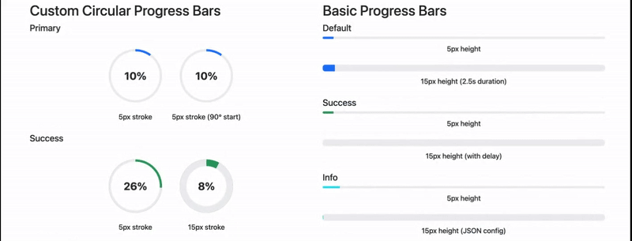

[](https://www.npmjs.com/package/bootstrap-progress-extension)
[](https://www.npmjs.com/package/bootstrap-progress-extension)
[](https://github.com/dxpr/bootstrap-progress-extension)

# Bootstrap Progress Bar Extension

Enhanced progress components with circular progress and animations for Bootstrap 5.

**[View Live Demo](https://dxpr.github.io/bootstrap-progress-extension/)**



## Features

This package provides:

- Standard Bootstrap Progress Bar Extension with animation
- Custom circular progress bars 
- Viewport-based animation triggers
- Configurable animation duration and delays
- Multiple color variants (primary, success, info, warning, danger)
- Stroke width customization for circular progress
- Built-in accessibility features
- Lightweight implementation (only ~325 lines of JS)
- Support for dynamically added progress bars

## Installation

```bash
npm install bootstrap-progress-extension
```

Include the CSS and JavaScript files in your project:

```html
<!-- For production -->
<link href="path/to/bootstrap-progress-extension.min.css" rel="stylesheet">
<script src="path/to/bootstrap-progress-extension.min.js"></script>

<!-- For development/debugging -->
<link href="path/to/bootstrap-progress-extension.css" rel="stylesheet">
<script src="path/to/bootstrap-progress-extension.js"></script>
```

## Usage

### Basic Progress Bar

```html
<div class="progress" role="progressbar" aria-label="Basic example" 
     aria-valuenow="75" aria-valuemin="0" aria-valuemax="100"
     data-bs-config='{"duration": 2000}'>
  <div class="progress-bar"></div>
</div>
```

### Circular Progress Bar

```html
<div class="progress circular" role="progressbar" aria-label="Circular progress"
     aria-valuenow="75" aria-valuemin="0" aria-valuemax="100"
     data-bs-config='{"strokeWidth": 15, "animateInViewport": true}'>
  <div class="progress-bar bg-success">
    <div class="circle-background"></div>
    <div class="circle-progress"></div>
    <div class="progress-label">0%</div>
  </div>
</div>
```

### RTL Support (Right-to-Left)

For RTL languages like Arabic, Hebrew, or Persian, simply wrap your progress bar in a container with `dir="rtl"`:

```html
<div dir="rtl">
  <!-- Circular Progress in RTL -->
  <div class="progress circular" role="progressbar" aria-label="تقدم دائري"
       aria-valuenow="65" aria-valuemin="0" aria-valuemax="100"
       data-bs-config='{"strokeWidth": 15, "duration": 2000}'>
    <div class="progress-bar bg-primary">
      <div class="circle-background"></div>
      <div class="circle-progress"></div>
      <div class="progress-label">٦٥٪</div>
    </div>
  </div>
  
  <!-- Standard Progress Bar in RTL -->
  <div class="progress" role="progressbar" aria-label="شريط التقدم"
       aria-valuenow="70" aria-valuemin="0" aria-valuemax="100"
       data-bs-config='{"duration": 1800}'>
    <div class="progress-bar bg-success"></div>
  </div>
</div>
```

### Dynamic Creation

Progress bars added dynamically to the DOM after page load will be automatically initialized:

```javascript
// Create a progress bar dynamically
const progressBar = document.createElement('div');
progressBar.className = 'progress';
progressBar.setAttribute('role', 'progressbar');
progressBar.setAttribute('aria-label', 'Dynamic progress');
progressBar.setAttribute('aria-valuenow', '60');
progressBar.setAttribute('aria-valuemin', '0');
progressBar.setAttribute('aria-valuemax', '100');

const bar = document.createElement('div');
bar.className = 'progress-bar bg-success';
bar.style.width = '0%';

progressBar.appendChild(bar);
document.body.appendChild(progressBar);
// No manual initialization needed - MutationObserver will detect and initialize it
```

## Configuration Options

All progress components can be configured using the `data-bs-config` attribute with JSON:

| Option | Type | Default | Description |
|--------|------|---------|-------------|
| `strokeWidth` | Number | `15` | Sets the stroke width in pixels for circular progress bars |
| `size` | Number | `120` | Sets the size in pixels for circular progress bars |
| `duration` | Number | `1500` | Animation duration in milliseconds |
| `delay` | Number | `0` | Delay before animation starts in milliseconds |
| `animation` | Boolean | `true` | Whether to animate the progress |
| `animateInViewport` | Boolean | `true` | Only animate when the element enters the viewport |

## JavaScript API

Working with progress bars programmatically:

```javascript
// Create a new progress bar instance
const progressElement = document.querySelector('.progress');
const progressBar = new ProgressBar(progressElement);

// Set value without animation
progressBar.setValue(75);

// Animate to value (target percentage, optional duration)
progressBar.animate(90, 2000);

// Initialize to 0%
progressBar.initialize();
```

## Accessibility Features

Bootstrap Progress Bar Extension are built with accessibility in mind:

- **ARIA Support**: All progress bars use proper ARIA attributes (`role="progressbar"`, `aria-valuenow`, `aria-valuemin`, `aria-valuemax`, and `aria-label`)
- **Reduced Motion**: Automatically respects the user's `prefers-reduced-motion` browser setting, disabling animations for users who prefer reduced motion
- **Text Labels**: Circular progress bars include visible text labels showing the current progress percentage
- **Color Contrast**: All components maintain proper contrast ratios between background, foreground, and text elements
- **RTL Support**: Full support for right-to-left languages using the `dir="rtl"` attribute
- **Responsive Design**: Components adapt to different screen sizes for usability on mobile devices

## Browser Compatibility

- Chrome/Edge 60+
- Firefox 60+
- Safari 12+
- iOS 12+
- Not compatible with Internet Explorer

## License

MIT